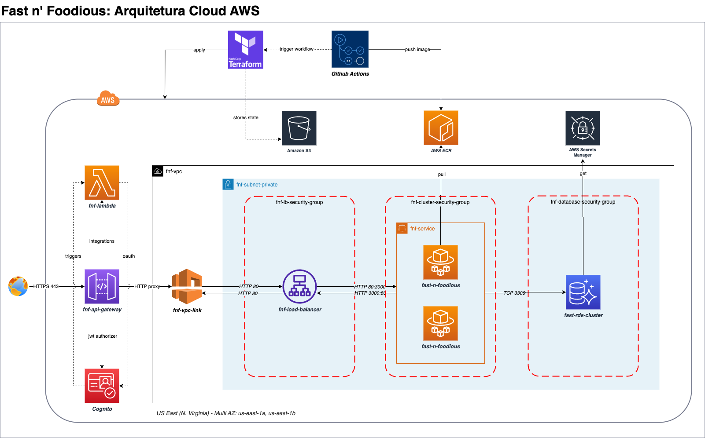

 

 

# 🍔 Fast & Foodious - IaC 
Sistema de auto-atendimento de fast food. Projeto de conclusão da Fase 03 da pós gradução em Software Architecture.




## Módulo IaC: Network
Repositório de criação de infraestrutura cloud AWS, responsável por criar os seguintes recursos:

```
fast-n-foodious-iac-network
├── fnf-loadbalancer.tf                         # Definição de recurso Load Balancer
├── fnf-network.tf                              # Definição de recursos de rede
├── fnf-security-group.tf                       # Definição de recurso de segurança de rede
├── main.tf                                     # Definição de terraform providers e backend 
├── outputs.tf                                  # Definição de terraform outputs, necessários em módulos externos
```